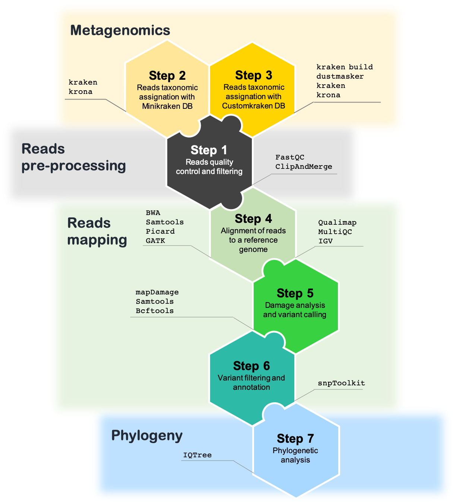

.. Paleogenomics documentation master file, created by
   sphinx-quickstart on Wed Apr  3 18:30:38 2019.
   You can adapt this file completely to your liking, but it should at least
   contain the root `toctree` directive.

#############
Paleogenomics
#############

Welcome to the 2nd edition of the "Physalia Paleogenomics" course, Berlin 17-21 June 2019.

********
Contents
********

.. toctree::
   :maxdepth: 2
   :numbered:
   
   1_ListTools
   2_ReadsFiltering
   3_Metagenomics_v2
   4_ReadsMapping_v2
   7_VariantsCall
   8_Filtering_SNPs
   9_DIY
   
**Course overview**

* :ref:`genindex`
* :ref:`modindex`
* :ref:`search`
